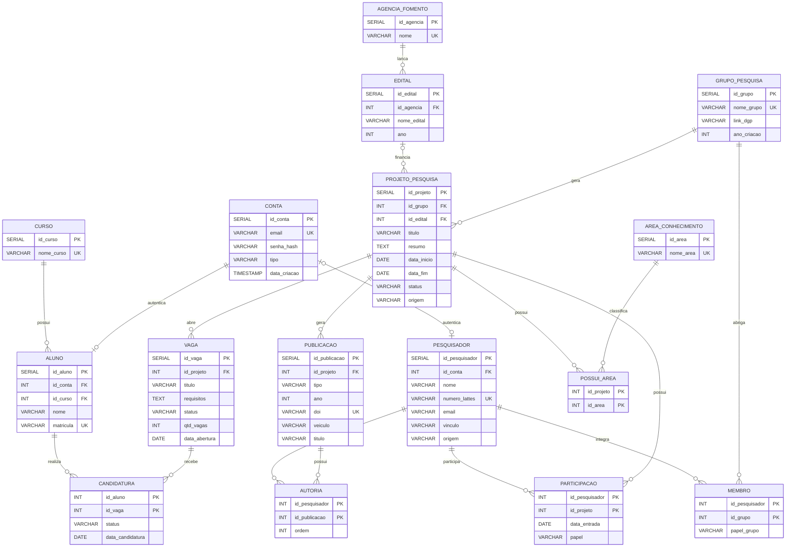

# Scientia - Hub de Produção Científica do BCC/UFAPE

## Integrantes
[Lucas Feitoza](https://github.com/hazdriel) | [Carlos Gabyrel Espianhara](https://github.com/cgabryel0) | [Laura Vitória Mendes](https://github.com/l4uramendes)

## Sobre o Projeto
Projeto para implementação de um hub de produção científica do curso de __Bacharelado em Ciência da Computação (BCC)__ da UFAPE, desenvolvido para a disciplina de __Engenharia de Software__ ministrada pela Professora [Thaís Burity](https://github.com/taburity), referente ao período de 2026.1.

O Scientia tem como propósito centralizar, organizar e dar visibilidade à produção científica da comunidade acadêmica do BCC, reunindo artigos, projetos de pesquisa, trabalhos de conclusão de curso e demais publicações de docentes e discentes do curso.

## Objetivos
O sistema deve permitir o cadastro e a consulta das produções científicas do curso, vinculando cada produção aos seus autores. Com isso, alunos, professores e visitantes poderão explorar o acervo científico do BCC de maneira rápida e prática, acompanhando o que é produzido no curso e facilitando a divulgação e o acesso aos trabalhos acadêmicos.

## Tecnologias Usadas
### [React](https://react.dev/) + [Vite](https://vite.dev/)
* Frontend em JavaScript, com React Router para a navegação
### [Node.js](https://nodejs.org/) + [Express](https://expressjs.com/)
* Backend em JavaScript expondo a API REST
### [JWT](https://jwt.io/) + [bcrypt](https://www.npmjs.com/package/bcryptjs)
* Autenticação por token e senhas guardadas como hash
### [PostgreSQL](https://www.postgresql.org/) + [Docker](https://www.docker.com/)
* Banco relacional, versão 16, rodando em contêiner

## Status do Projeto
Em desenvolvimento - segunda iteração (controle de acesso) concluída.

## Segunda iteração: controle de acesso
Esta iteração implementou cadastro, login e logout com JWT, além da autorização
pelos papéis `ADMIN` e `USER`. As histórias de usuário, os critérios de aceitação
e a quebra em tarefas estão em [docs/historias-de-usuario.md](docs/historias-de-usuario.md).

Como funciona, em resumo:

* No cadastro e no login o backend devolve um **token JWT** assinado e com validade.
* O frontend guarda esse token e o envia no cabeçalho `Authorization` de toda
  requisição a rota protegida.
* Um **middleware de autenticação** intercepta todas as requisições da API. Só as
  rotas listadas como públicas em `backend/src/config/seguranca.js` passam sem token.
* Um **middleware de autorização** trava as rotas que exigem um papel específico.
* No logout o token entra numa lista de encerrados e passa a ser recusado, então
  não adianta reaproveitar um token copiado antes de sair.
* No frontend, o componente `RotaProtegida` funciona como **guard**: sem sessão
  manda para o login, e sem o papel exigido manda para a tela de acesso negado.

### Endpoints da API

| Método | Rota                  | Acesso            |
| ------ | --------------------- | ----------------- |
| GET    | `/api/status`         | Público           |
| POST   | `/api/auth/cadastro`  | Público           |
| POST   | `/api/auth/login`     | Público           |
| POST   | `/api/auth/logout`    | Autenticado       |
| GET    | `/api/auth/perfil`    | Autenticado       |
| GET    | `/api/usuarios`       | Somente `ADMIN`   |

## Executando o projeto
Precisa do [Node.js](https://nodejs.org/) 20 ou superior e do
[Docker](https://www.docker.com/) para o banco.

### Banco de dados
```bash
docker compose up -d
```
Sobe em `localhost:5432`, já criado e povoado.

### Backend
```bash
cd backend
npm install
cp .env.example .env
npm run dev
```
Disponível em `http://localhost:3000`.

Quando o servidor sobe, ele cria a conta de administrador definida no `.env`
(por padrão `admin@scientia.ufape.br` / `admin123`), que serve para testar as
rotas restritas ao papel `ADMIN`.

### Frontend
```bash
cd frontend
npm install
npm run dev
```
Disponível em `http://localhost:5173`.

> A API ainda guarda usuários e produções em memória, então eles somem quando o
> servidor é reiniciado. O banco descrito abaixo já está pronto, mas ainda não
> está ligado à API. Fazer essa ligação mexe em
> `backend/src/models/repositorioUsuarios.js` e
> `backend/src/models/repositorioProducoes.js`, e ficou para a próxima iteração.

---

# Banco de Dados

Esta parte do repositório é a entrega da disciplina de Banco de Dados. É o MERE
que fizemos na etapa anterior, mapeado para o esquema lógico relacional e já
implementado e povoado.

## Integrantes
Lucas Feitoza | Carlos Gabyrel Espianhara | Laura Vitória Mendes | Heitor Calado Duque de Araújo

O Heitor integra o grupo apenas em Banco de Dados, por isso não aparece na lista
de integrantes do projeto lá em cima.

A regra que guia o modelo é que navegar na vitrine é público e agir exige login.
Por isso o login fica numa tabela `conta` separada, e não dentro de `pesquisador`
ou `aluno`: um pesquisador puxado do Lattes precisa aparecer na vitrine mesmo sem
nunca ter criado conta.

## Configuração de acesso

| Item | Valor |
|---|---|
| SGBD | PostgreSQL 16 |
| Host | `localhost` |
| Porta | `5432` |
| Nome do banco | `scientia` |
| Usuário | `scientia` |
| Senha | `scientia` |

## Como executar

```bash
docker compose up -d
```

O banco sobe já criado e povoado, sem passo manual nenhum. A imagem do PostgreSQL
roda sozinha os arquivos que estão em `database/init` na primeira vez que o volume
é criado, na ordem do nome: primeiro o `01-schema.sql`, depois o `02-seed.sql`.

Outros comandos úteis:

```bash
docker compose logs -f db
docker exec -it scientia-db psql -U scientia -d scientia
docker compose down -v && docker compose up -d
```

O `-v` do último é necessário porque os scripts de init só rodam com o volume vazio.

## Estrutura dos arquivos

```
docker-compose.yml
database/
  init/
    01-schema.sql
    02-seed.sql
  docs/
    diagrama-logico.mermaid
    diagrama-logico-uml.png
```

## Diagrama Lógico

O diagrama em notação UML, com as tabelas, os tipos, as chaves e as cardinalidades,
está em [database/docs/diagrama-logico-uml.png](database/docs/diagrama-logico-uml.png).

A mesma estrutura em pé-de-galinha, versionada como texto em
[database/docs/diagrama-logico.mermaid](database/docs/diagrama-logico.mermaid):



## Normalização

O esquema está na 3FN.

* **1FN** - todos os atributos são atômicos e não há grupo repetitivo.
* **2FN** - as tabelas de chave composta (`membro`, `participacao`, `possui_area`,
  `autoria`, `candidatura`) só guardam atributos que dependem da chave inteira.
* **3FN** - não há dependência transitiva. O órgão de fomento virou a tabela
  `agencia_fomento` em vez de ficar repetido como texto em cada edital. E quem
  coordena um projeto é o `papel` da `participacao`, não um campo do projeto, então
  não tem como dois lugares discordarem.

Os N:N do conceitual viraram tabelas de junção, com chave primária composta pelas
duas chaves estrangeiras.

## Povoamento

O `02-seed.sql` roda junto com o schema e insere 2.538 tuplas.

As tabelas menores foram escritas à mão, com dados reais: os cursos da UFAPE, as
áreas do CNPq e as agências de fomento. O resto é gerado com `generate_series`
combinando vetores de nomes, sobrenomes, temas de pesquisa e recortes geográficos
do Agreste.

Não usamos `random()`. A escolha de cada pedaço de texto vem de uma conta com o
número da linha, então a carga sai idêntica em qualquer máquina. Isso ajuda a
testar: dá para escrever uma consulta e saber de antemão o resultado que ela tem
que dar. Os multiplicadores dessas contas foram escolhidos para não terem divisor
comum com o tamanho do vetor, senão parte dos valores nunca seria sorteada.

Nas tabelas de junção o mesmo cálculo garante que os três parceiros de cada
registro pai saiam diferentes entre si, sem violar a chave composta.

A tabela `carga_pessoa` monta nome e e-mail das 170 pessoas uma vez só, e é usada
por `conta`, `aluno` e `pesquisador` para os três ficarem coerentes. No fim do
script ela é apagada e as sequências dos `SERIAL` são acertadas com `setval`.

## Volume de dados

| Tabela | Classificação | Tuplas |
|---|---|---|
| `conta` | principal | 150 |
| `pesquisador` | principal | 80 |
| `aluno` | principal | 90 |
| `grupo_pesquisa` | principal | 55 |
| `projeto_pesquisa` | principal | 120 |
| `publicacao` | principal | 200 |
| `vaga` | principal | 90 |
| `edital` | principal | 60 |
| `participacao` | principal | 360 |
| `autoria` | principal | 600 |
| `candidatura` | principal | 270 |
| `possui_area` | principal | 240 |
| `membro` | principal | 165 |
| `area_conhecimento` | secundária | 24 |
| `curso` | secundária | 18 |
| `agencia_fomento` | secundária | 16 |

## Dicionário de Dados

A descrição de cada tabela e de cada atributo, com tipo, restrições e o significado
dos códigos guardados em campos como `status`, `origem` e `papel`, está em
[database/docs/dicionario-de-dados.pdf](database/docs/dicionario-de-dados.pdf).

O mesmo conteúdo em markdown, que é o que geramos o PDF a partir de, está em
[database/docs/dicionario-de-dados.md](database/docs/dicionario-de-dados.md).
